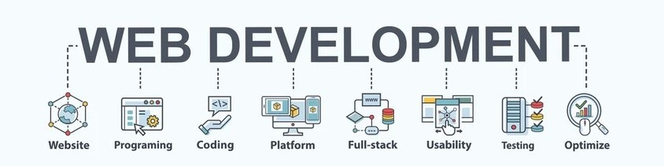

<h1 align="center">Hi! 👋, I´m Juan Martinez</h1>

<h2 align="center">Living in beta mode: always exploring what’s new in technology.</h2>

<h3 align="justify">A full-stack developer with a strong motivation to learn and grow in the world of web development. I specialize in the use of technologies such as JavaScript, TypeScript, Node.js, NestJS, Express, and PostgreSQL, applying good development practices, RESTful API structures, and version control with Git, including HTML, CSS, and modern frameworks like React. </h3>

<h2 align="center">featured projects <h2/>

<h2 align="left">Connect with me:</h2>

  
   <a href="www.linkedin.com/in/juan-antonio-martínez-fernández-486495367" target="_blank" rel="noreferrer">LinkedIn</a>
   

<h2 align="left">Languages and Tools:</h2>

  

  

 

  

